# Functional Flow Diagrams

## Table of Contents
1. [User Authentication Flows](#user-authentication-flows)
2. [Direct Messaging Flows](#direct-messaging-flows)
3. [Group Management Flows](#group-management-flows)
4. [Group Messaging Flows](#group-messaging-flows)
5. [WebRTC Calling Flows](#webrtc-calling-flows)
6. [Logging Flows](#logging-flows)

---

## 1. User Authentication Flows

### 1.1 User Registration Flow

### 1.2 User Login Flow

### 1.3 Protected Route Access Flow

```mermaid
sequenceDiagram
    participant Client
    participant API
    participant AuthMiddleware
    participant Database
    participant Controller

    Client->>API: Request with Bearer Token
    API->>AuthMiddleware: authenticate()
    
    alt No Authorization Header
        AuthMiddleware-->>Client: 401 Unauthorized
    else Has Authorization Header
        AuthMiddleware->>AuthMiddleware: Extract token
        AuthMiddleware->>AuthMiddleware: Verify JWT
        
        alt Token Invalid/Expired
            AuthMiddleware-->>Client: 401 Token expired
        else Token Valid
            AuthMiddleware->>Database: Find user by ID
            
            alt User Not Found
                AuthMiddleware-->>Client: 404 User not found
            else User Found
                AuthMiddleware->>AuthMiddleware: Attach user to request
                AuthMiddleware->>Controller: next()
                Controller-->>Client: Process request
            end
        end
    end
```

---

## 2. Direct Messaging Flows

### 2.1 Send Direct Message (Socket.IO)

### 2.2 Get Chat History

```mermaid
sequenceDiagram
    participant Client
    participant API
    participant Controller
    participant Service
    participant Database
    participant Encryption
    participant Logger

    Client->>API: GET /user/chatHistory/:toUser
    API->>Controller: getChatHistory()
    Controller->>Service: getUserChatHistoryService()
    Service->>Logger: Log START
    Service->>Database: Find messages (fromUser ↔ toUser)
    Database-->>Service: Encrypted messages
    Service->>Service: Loop through messages
    loop For each message
        Service->>Encryption: decryptMessage()
        Encryption->>Logger: Log decryption
        Encryption-->>Service: Decrypted message
    end
    Service->>Logger: Log END (message count)
    Service-->>Controller: Decrypted messages
    Controller-->>Client: 200 Success
```

---

## 3. Group Management Flows

### 3.1 Create Group Flow

### 3.2 Join Group Flow (Open Group)

### 3.3 Join Group Flow (Private Group)

### 3.4 Approve Join Request Flow

### 3.5 Ban Member Flow

---

## 4. Group Messaging Flows

### 4.1 Send Group Message (Socket.IO)

### 4.2 Get Group Message History

---

## 5. WebRTC Calling Flows

### 5.1 Call Initiation Flow

### 5.2 WebRTC Connection Establishment

---

## 6. Logging Flows

### 6.1 Service Execution Logging Flow

### 6.2 Log Query Flow

### 6.3 Log Statistics Flow

---

## Summary

These functional flow diagrams illustrate:

1. **User Authentication**: Registration, login, and protected route access
2. **Direct Messaging**: Real-time messaging with encryption
3. **Group Management**: Creation, joining (open/private), approval, and banning
4. **Group Messaging**: Real-time group communication
5. **WebRTC Calling**: Call initiation and connection establishment
6. **Logging**: Comprehensive logging with MongoDB storage and querying

Each flow demonstrates the interaction between components, error handling, and logging integration throughout the application.
